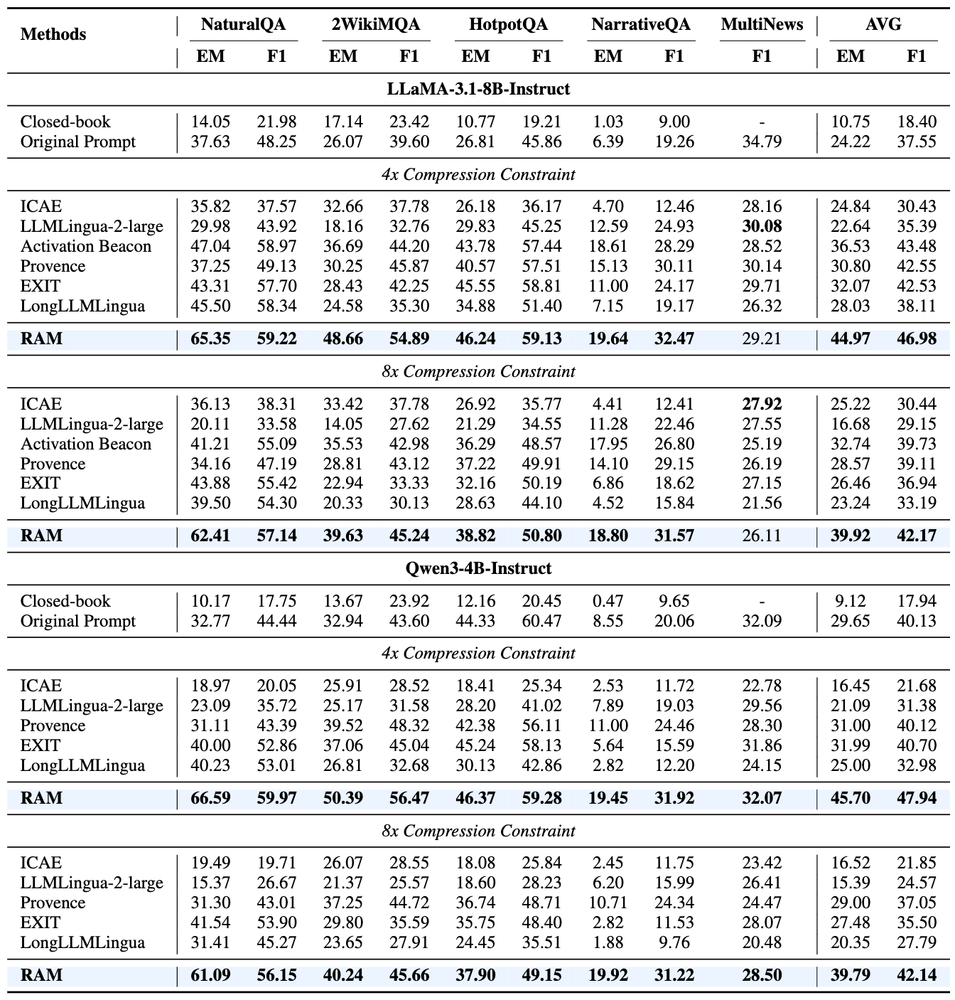

<div align="center">

<h2>Read As Human: Compressing Context via Parallelizable Close Reading and Skimming</h2>

<p>
  <a href="https://scholar.google.com/citations?user=v7oMH04AAAAJ&hl=zh-CN">Jiwei Tang</a><sup>1,2</sup> ·
  Shilei Liu<sup>2</sup> ·
  Zhicheng Zhang<sup>1</sup> ·
  Qingsong Lv<sup>1</sup> ·
  Runsong Zhao<sup>3</sup> ·
  Tingwei Lu<sup>1</sup> ·
  Langming Liu<sup>2</sup> ·
  Haibin Chen<sup>2</sup> ·
  Yujin Yuan<sup>2</sup> ·
  Hai-Tao Zheng<sup>1*</sup> ·
  Wenbo Su<sup>2</sup> ·
  Bo Zheng<sup>2*</sup>
</p>
<p>
  <sup>1</sup> Tsinghua University ·
  <sup>2</sup> Future Living Lab of Alibaba ·
  <sup>3</sup> Northeastern University, China
</p>

</div>

<div align="center">
  <a href="https://arxiv.org/abs/2602.01840">
    
  </a>
</div>


This is the official implementation of **“Read As Human: Compressing Context via Parallelizable Close Reading and Skimming.”** RAM is a task-aware context compression framework inspired by how people combine close reading of important passages with skimming of background material.

## Motivation

Long-context LLM inference is expensive, and natural-language inputs contain substantial redundancy. Existing task-aware compressors may process the whole sequence at once, depend on autoregressive compression, discard low-relevance text entirely, or replace all text with implicit vectors. These choices create trade-offs among efficiency, information preservation, and natural-language interpretability.

RAM uses a parallel, adaptive hybrid reading strategy: highly relevant content is retained verbatim, while less relevant content is compressed into compact query-guided representations.

## Method

RAM operates in two stages:

- **Query-aware parallel encoding:** split the context into fixed-width segments, encode all segments together with the query in parallel, and compute query-segment relevance from their representations.
- **Close reading:** retain the highest-relevance segments as their original token embeddings, preserving explicit text and detailed semantics.
- **Skimming:** compress each remaining segment into one query-weighted summary vector.
- **Hybrid representation:** concatenate retained explicit tokens and compressed implicit vectors in their original order, then append the query prompt for decoder generation.
- **Joint training:** combine the answer-generation language-modeling loss with a contrastive objective that improves discrimination between positive and negative query-segment pairs.

<div align="center">
  
  <p>Compression Process of RAM.</p>
</div>

## Main Results

The paper evaluates RAM on four long-context question-answering benchmarks and the MultiNews summarization benchmark using two backbone model families. It reports consistent improvements over hard- and soft-compression baselines under multiple compression budgets, together with up to 12× end-to-end acceleration on long inputs with average length 16K and maximum length 32K. See the [paper](https://arxiv.org/abs/2602.01840) for full results, efficiency settings, robustness studies, and ablations.

<div align="center">
  
</div>

## Case Study
<div align="center">
  
</div>

## Environment Setup

The project is designed for NVIDIA GPUs, BF16, and FlashAttention 2. A reference environment matching the current GMSA stack is:

```bash
conda create -n ram python=3.10 -y
conda activate ram

pip install torch==2.4.0 torchvision==0.19.0 torchaudio==2.4.0 --index-url https://download.pytorch.org/whl/cu118
pip install \
  transformers==5.1.0 datasets==4.3.0 peft==0.13.0 \
  deepspeed==0.18.7 accelerate==1.13.0 safetensors==0.7.0 \
pip install flash-attn==2.6.3 --no-build-isolation
```

## Data Format

RAM consumes NaturalQuestions-style JSONL. Each line must contain:

```json
{
  "question": "Question text...",
  "answers": ["reference answer", "optional alternative answer"],
  "ctxs": [
    {
      "title": "Optional document title",
      "text": "Document text...",
      "isgold": true
    }
  ]
}
```

- `question`: required non-empty string.
- `answers`: required non-empty list. The first answer is used as the training target; all references are used for evaluation and contrastive segment labeling.
- `ctxs`: required non-empty list of documents.
- `ctxs[*].text`: required non-empty string.
- `ctxs[*].title`: optional string prepended to the document text.
- `ctxs[*].isgold`: accepted dataset metadata. Positive contrastive labels are computed by matching answer token sequences in the assembled context.

Override `NQ_FILE` for path of the dataset.

## Training

Run the training script:

```bash
bash train.sh
```

To initialize training from existing weights, set `RESTORE_FROM` to a checkpoint file or a directory containing `model.safetensors` or `pytorch_model.bin`.

## Inference and Evaluation

Evaluate a checkpoint with `test.sh`:

```bash
bash test.sh
```

The output names include compression settings and the actual number of evaluated rows:
- `nq_inference_results_c<compression-rate>_k<keep-ratio>_<count>.jsonl`: question, prediction, references, per-example EM, and per-example F1.
- `nq_inference_metrics_c<compression-rate>_k<keep-ratio>_<count>.json`: total sample count, average EM, and average F1.

## Main Launcher Variables

| Variable | Training default | Description |
| --- | --- | --- |
| `NQ_FILE` | `/path/to/nq_ram.jsonl` | NaturalQuestions JSONL. |
| `MODEL_NAME` | `Qwen/Qwen3-4B-Instruct-2507` | Hugging Face model identifier/path. |
| `OUTPUT_DIR` | `./output/ram_qwen3-4b` | `./eval_result` | Checkpoint or evaluation directory. |
| `RESTORE_FROM` | empty | Checkpoint directory/file. |
| `COMPRESSION_RATE` | `16` | Segment width. |
| `KEEP_RATIO` | `0.25` | Fraction of highest-scoring segments retained as original tokens; must be in `[0, 1]`. |
| `USE_CONTRASTIVE_LOSS` | `True` | Enable answer-segment contrastive supervision. |
| `CONTRASTIVE_LOSS_WEIGHT` | `1.0` | Contrastive term weight. |
| `USE_TRANSFORM_LAYER` | `True` | Constructs the optional fusion module; the current memory-generation path does not invoke its alignment call. |
| `NUM_MEM_FUSION_LAYERS` | `1` | Number of layers in the constructed fusion module. |
| `NUM_GPUS` | `1` | Number of `torchrun` workers. |
| `NUM_SAMPLES` | `1` | Evaluation sample limit. |

## Checkpoints and Tests

Training writes Hugging Face Trainer `checkpoint-*` directories and final weights under `OUTPUT_DIR`. Inference accepts either SafeTensors or PyTorch binary checkpoints and loads them non-strictly to support alternate checkpoint key layouts.

Run the inference script:

```bash
bash test.sh
```

## BibTeX

If you find this repository useful, please cite the paper:

```bibtex
@article{DBLP:journals/corr/abs-2602-01840,
  author       = {Jiwei Tang and
                  Shilei Liu and
                  Zhicheng Zhang and
                  Qingsong Lv and
                  Runsong Zhao and
                  Tingwei Lu and
                  Langming Liu and
                  Haibin Chen and
                  Yujin Yuan and
                  Hai{-}Tao Zheng and
                  Wenbo Su and
                  Bo Zheng},
  title        = {Read As Human: Compressing Context via Parallelizable Close Reading
                  and Skimming},
  journal      = {CoRR},
  volume       = {abs/2602.01840},
  year         = {2026}
}
```
